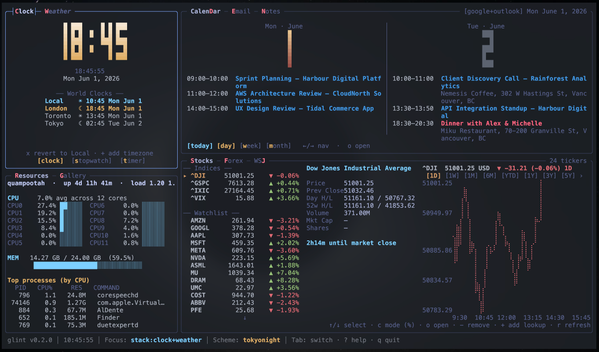
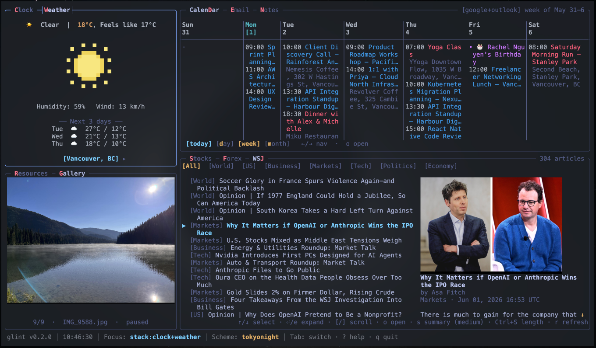
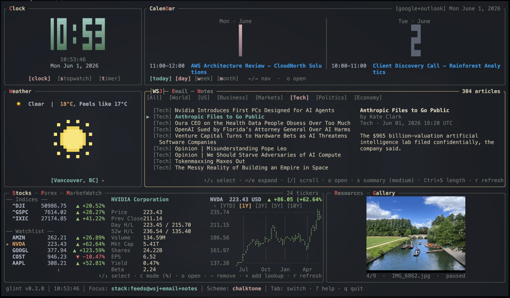
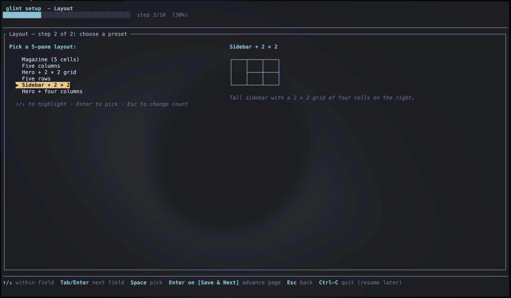

# glint

A fast, keyboard-driven terminal dashboard. Stocks, forex + crypto,
calendar, weather, news, email, notes, system resources, image gallery —
all in one grid you compose yourself. Written in Rust with
[ratatui](https://ratatui.rs).

https://github.com/user-attachments/assets/31f79aef-412c-44fb-bd72-c684e6aa9185

*A live capture — keyboard shortcuts driving focus, view changes, and
widget interaction across the dashboard.*



*A composed dashboard — clock + weather on the left, a calendar / email
/ notes stack and a stocks / forex / WSJ stack on the right, system
resources and a rotating gallery filling the rest. `tokyonight` scheme.*



*Same layout, different views — calendar in week mode, weather showing
the 3-day forecast, the gallery rotating its next image, and the WSJ
feed scrolling the latest articles in the middle stack.*



*A different 5-pane layout in the `chalktone` scheme, focused on the
WSJ stack with an NVDA chart open in stocks on the right.*

Everything is opt-in, locally configured, and persists in plain TOML
under `~/.config/glint/` — no accounts, no telemetry, no cloud
component glint controls. The setup wizard generates a working
dashboard on first launch.

---

## Highlights

- **Ten widget kinds**, each independently configurable, with sensible
  built-in defaults — see the [widget catalogue](#widget-catalogue) below.
- **Composable layout**: a grid of cells; any cell can be a single
  widget or a **stack** of widgets you cycle between with `.` / `,`.
- **Multi-instance** — run the same widget kind in several panes
  (`stocks@watchlist1` + `stocks@watchlist2`, `clock@home` + `clock@office`).
- **Profiles** — `glint --profile work` (or `-p work`) runs an isolated
  config tree: its own layout, widgets, theme, and accounts. The
  colorscheme library and OAuth app registrations are shared; everything
  else is per-profile. See [INSTRUCTIONS.md → Profiles](INSTRUCTIONS.md#profiles).
- **Live config reload** — edit any widget's TOML and the dashboard
  picks it up without a restart.
- **Theming** — nine bundled colour schemes; per-widget colour overrides;
  add your own schemes by editing one TOML file. `:scheme nord` switches
  live.
- **Setup wizard** — `glint --setup` (or first launch with no config)
  walks you through layout, widget assignment, and credentials with
  copy-pasteable instructions for each external service.
- **Keyboard-first, mouse-friendly** — `Tab` cycles widgets,
  `Shift+<letter>` jumps to a widget by its shortcut letter, `:` opens
  a command bar, click anywhere to focus.
- **No cloud component**: every credential lives on disk under
  `~/.config/glint/credentials/` (0600 perms). API calls go directly
  from your machine to the upstream service.

---

## Install

### From source (only option for now)

You need a recent Rust toolchain (1.81+). Install via
[`rustup`](https://rustup.rs/) if you don't have one.

```sh
git clone https://github.com/ntrospect0/glint.git glint
cd glint

# Per-user install (no sudo, installs to ~/.local/bin):
make install PREFIX=~/.local

# Or system-wide (typically needs sudo):
sudo make install
```

If `~/.local/bin` isn't on your `$PATH`, add this to `~/.zshrc` or
`~/.bashrc`:

```sh
export PATH="$HOME/.local/bin:$PATH"
```

Verify:

```sh
glint --version
```

### Makefile targets

| target | what it does |
|---|---|
| `make` / `make release` | release build at `target/release/glint` |
| `make build` | debug build (faster compile, slower runtime) |
| `make install` | release build + copy to `$(PREFIX)/bin/glint` |
| `make uninstall` | remove `$(PREFIX)/bin/glint` |
| `make test` | run the test suite |
| `make clean` | `cargo clean` |

### Slim builds

Every widget compiles in only when its feature is enabled. The default
`widgets-all` umbrella turns them all on. For a smaller binary:

```sh
cargo install --path . --no-default-features \
  --features widget-clock,widget-weather,widget-stocks
```

Available features: `widget-clock`, `widget-weather`, `widget-calendar`,
`widget-news`, `widget-stocks`, `widget-forex`, `widget-email`,
`widget-resources`, `widget-gallery`, `widget-notes`.

### Updating

```sh
git pull
make install PREFIX=~/.local   # or sudo make install
```

### macOS app icon (optional)


glint is a terminal program, but on macOS you can wrap it in a
double-clickable app that opens it in your terminal — handy for the
Dock or Spotlight. The icon assets live in
[`assets/icon/`](assets/icon/) (`glint.png` and `glint.icns`).

With glint on your `$PATH`:

```sh
./assets/icon/install-macos-app.sh
```

This builds `~/Applications/Glint.app` with the icon above, launching
glint in `~`. First open may need a right-click → **Open** (the bundle
isn't code-signed).

The script auto-detects an installed terminal and supports **Kitty,
Ghostty, WezTerm, Alacritty, Rio** (launched directly) and **iTerm2,
Apple Terminal** (via AppleScript). Force one with the `TERMINAL` env
var:

```sh
TERMINAL=alacritty ./assets/icon/install-macos-app.sh
```

Warp, Hyper, and Tabby expose no command to run a program in a new
window, so they aren't supported — add a case to the script if your
terminal isn't listed.

---

## Quickstart

Launch with no existing config and you land in the setup wizard:

```sh
glint
# → "No config detected … launching the setup wizard."
```

The wizard walks you through:

1. **Global settings** — colour scheme, mouse-scroll direction, optional
   LLM provider and API key.
2. **Layout** — pick 1 to 8 panes and a layout preset.
3. **Widget assignment** — pick the widget kind that fills each pane,
   including the option to stack multiple widgets in a single cell.
4. **Per-widget setup** — timezone, location, RSS feeds, watchlist
   tickers, calendar providers, mailbox folders, gallery image paths.
5. **OAuth flows** (where needed) — Gmail, Outlook, Google Calendar all
   captured inline through the wizard with copy-paste instructions.



*The wizard's layout step — pick a pane count, then a preset; widget
assignment follows on the next page.*

Re-run any time with `glint --setup`. Every section has an
**Edit / Skip** gate; skipping leaves that TOML untouched, so hand-edits
and comments survive.

After the wizard, the dashboard launches with your layout. Press `?` for
the live keybinding overlay.

---

## Widget catalogue

| widget | what it does | external services |
|---|---|---|
| **Clock** | big block-digit local time, optional secondary world clocks, configurable gradient | none |
| **Weather** | current conditions + N-day forecast, IP geolocation fallback | [Open-Meteo](https://open-meteo.com) (free, key-less) |
| **Calendar** | day / week / month views with event agenda | Google Calendar (OAuth), Microsoft Outlook (OAuth), CalDAV (iCloud / Fastmail / Nextcloud), local TOML events |
| **News** | RSS / Atom aggregator with topic filters, keyword search (`:news <terms>`), optional per-article LLM summaries | any RSS/Atom feed; LLM provider for summaries |
| **Stocks** | watchlist with price + change %, intraday + multi-year graphs, period toggle | [Yahoo Finance](https://finance.yahoo.com) (free, key-less) |
| **Forex** | fiat + crypto pairs with auto-grouped Currencies / Crypto sections, primary-swap with `s`, USD-pivot triangulation | Yahoo Finance |
| **Email** | unified inbox preview with optional per-message LLM summaries | Gmail (OAuth), Outlook (OAuth), any IMAP server (app password) |
| **Resources** | htop-style CPU / memory / top-process view | local `sysinfo` (no FFI) |
| **Gallery** | rotating inline image slideshow (any image glob you point it at) | none — uses iTerm2 / Kitty / Sixel inline image protocol, falls back to unicode half-blocks |
| **Notes** | vim-flavoured multi-note pad with undo/redo, mouse cursor positioning, per-note files | none — plain `.md` files under `~/.config/glint/notes/` |

Every widget is independently optional. The wizard surfaces only what
you turn on; missing credentials route gracefully into the inline
capture flow.

---

## Configuration

All files live under `~/.config/glint/`:

| file | what it controls |
|---|---|
| `config.toml` | active colour scheme, mouse-scroll direction, status bar, grid layout, widget cell placements |
| `colorschemes.toml` | named theme palettes (`default`, `chalktone`, `gruvbox`, `tokyonight`, `rosepine`, `nord`, `bluloco`, `onedark`, `miasma`) |
| `clock.toml` | primary timezone, world clocks, big-digit gradient |
| `weather.toml` | location, units (metric/imperial), forecast days, IP geolocation fallback |
| `news.toml` | RSS / Atom feeds, topic filters, LLM summary toggle, fetch-body strategy |
| `stocks.toml` | watchlist, indices, default period, jump URL template |
| `forex.toml` | primary currency, fiat watchlist, **separate crypto watchlist**, default period |
| `calendar.toml` | Google / Outlook / CalDAV / Local providers + per-provider calendar IDs |
| `email.toml` | folders / labels to follow, polling cadence, LLM-summary opt-in |
| `resources.toml` | refresh interval, top-N processes, sort key (CPU vs memory) |
| `gallery.toml` | image paths or globs, rotation cadence, rescan interval |
| `notes.toml` | per-widget shortcut + colour overrides (notes themselves live under `notes/`) |
| `llm.toml` | active LLM provider (`anthropic` or `openai`), model, rate limit, cache size |
| `credentials/` | OAuth tokens + API keys (`*_oauth_client.toml`, `*_oauth_token.<account>.toml`, `anthropic_key.toml`, `openai_key.toml`, `caldav.toml`, `imap.toml`) — 0600 perms |
| `notes/<instance>/` | one `.md` file per note, `mtime` sorts the list |

Most fields have sensible defaults; you only have to set what you care
about. Re-run the wizard any time, or hand-edit and `:reload`.

### Layout example

```toml
# config.toml
version = 1

[global]
theme = "nord"
mouse_scroll = "natural"
show_status_bar = true

[layout]
columns = [28, 36, 36]    # three columns at 28% / 36% / 36% of width
rows = [30, 35, 35]       # three rows at 30% / 35% / 35% of height

[[layout.cells]]
widget = "clock"
col = 0
row = 0

[[layout.cells]]
widget = "calendar"
col = 1
row = 0
col_span = 2              # span two columns

# Stack pane: three widgets share row 1, cols 1–2; rotate with . / ,
[[layout.cells]]
widgets = ["news", "email", "notes"]
col = 1
row = 1
col_span = 2

[[layout.cells]]
widgets = ["stocks", "forex"]
col = 0
row = 2
col_span = 2
```

### Multi-instance widgets

Cells can reference a widget as `kind@instance`:

```toml
[[layout.cells]]
widget = "stocks@watchlist1"
col = 0
row = 2

[[layout.cells]]
widget = "stocks@watchlist2"
col = 1
row = 2
```

The first uses `stocks.toml` (the implicit `main` instance), the others
read `stocks@watchlist1.toml` and `stocks@watchlist2.toml`. Same trick
works for clocks (home + office), calendars (work + personal), email
(two accounts), etc.

### Per-widget colour overrides

Any widget's TOML can carry a `[colors]` block that overrides the
active theme just for that widget:

```toml
# weather.toml
location = "Vancouver, BC"

[colors]
border.focused = { fg = "#e07b00", modifiers = ["bold"] }
widget_title.focused = { fg = "#fff", bg = "#e07b00", modifiers = ["bold"] }
```

Same field shape as `colorschemes.toml`.

### Adding a custom colour scheme

```toml
# colorschemes.toml
[schemes.my_scheme]
border.focused           = { fg = "#88c0d0", modifiers = ["bold"] }
border.unfocused         = "#3b4252"
widget_title.focused     = { fg = "#000", bg = "#88c0d0", modifiers = ["bold"] }
widget_title.unfocused   = { fg = "#eceff4", modifiers = ["bold"] }
metadata.focused         = { fg = "#d8dee9" }
metadata.unfocused       = { fg = "#616e88", modifiers = ["dim"] }
text.plain               = { fg = "#d8dee9" }
text.brilliant           = { fg = "#eceff4", modifiers = ["bold"] }
text.dim                 = { fg = "#616e88" }
text.selected            = { fg = "#ebcb8b", modifiers = ["bold"] }
text.focused             = { fg = "#88c0d0", modifiers = ["bold"] }
text.shortcut            = { fg = "#bf616a", modifiers = ["bold"] }
```

Then `:scheme my_scheme` (persisted to `[global] theme`).

> ⚠️ Dotted keys must be **unquoted** (`border.focused`, not
> `"border.focused"`). Quoted dotted keys silently fail to deserialize.

---

## Keybindings

### Global

| key | action |
|---|---|
| `Tab` / `Shift+Tab` | cycle focused widget |
| `Shift+<letter>` | jump focus to a widget by its shortcut letter (lit in title) |
| `click cell` | focus that widget |
| `.` / `,` | rotate the active widget in a stack pane |
| `:` | open the command bar |
| `?` | toggle help overlay (scrollable) |
| `q` / `Ctrl+C` | quit |

### Command bar (`:`)

| command | what it does |
|---|---|
| `:scheme <name>` | switch colour scheme (persists to `config.toml`) |
| `:reload` | re-read every widget's TOML without restarting |
| `:news <terms>` | filter News by keyword |
| `:weather <city>` | retarget Weather to a one-off city |
| `:time <city>` | retarget Clock |
| `:stock <symbol>` | jump-lookup a ticker in Stocks |
| `:fx <code>` | swap primary currency in Forex |

### Common per-widget keys

| widget | keys |
|---|---|
| **Stocks** | `↑/↓` select ticker · `←/→` cycle graph period · `c` % ↔ $ · `Enter` open in browser · `1–9` jump period · `y` yank value |
| **Forex** | `↑/↓` select pair · `←/→` cycle period · `s` / `Enter` make selected primary (crypto seeds amount=1) · `c` edit amount · `y` yank |
| **Calendar** | `d` / `w` / `m` day/week/month · `←/→` navigate · `t` today |
| **Weather** | `:weather <city>` retarget · `x` revert to default |
| **Clock** | `:time <city>` retarget · `x` revert to local |
| **News** | `↑/↓` select · `←/→` filter tabs · `e` expand · `s` LLM summary · `Enter` open · `x` clear search |
| **Email** | `↑/↓` select · `Enter` open in mail client · `e` expand · `s` LLM summary |
| **Resources** | `m` toggle sort (CPU ↔ memory) · `r` force refresh |
| **Gallery** | `p` pause/resume · `n` / `N` step · `↑/↓` rotation interval ±1s |
| **Notes** | `+` new · `-` delete (confirm) · `i` insert · `ESC` normal · `h`/`l` focus list / content · `j`/`k` scroll · `gg`/`G` top/bottom · `y` yank note · `Ctrl-A`/`Ctrl-E` line start/end · `Ctrl-U` delete line · `Ctrl-Z` / `Ctrl-Shift-Z` undo / redo |

Hit `?` while running for the full overlay with the current shortcut
assignments and active scheme.

---

## CLI reference

```sh
glint                    # launch the dashboard (or wizard on first run)
glint --setup            # launch the wizard
glint --init             # create ~/.config/glint/ with default seed files
glint --auth <provider>  # run an auth flow (google, microsoft, imap, anthropic, openai)
glint --clear-cache [TARGET]
                         # wipe ~/.cache/glint/ entirely, or scope to
                         # a widget kind (news) or instance (news@home)
glint --config <FILE>    # override the default XDG location
glint --version
```

---

## External dependencies

glint pulls every piece of remote data directly from the upstream
service; nothing routes through a glint-owned backend.

| service | used by | auth |
|---|---|---|
| [Open-Meteo](https://open-meteo.com) | Weather (forecast), Weather (geocoding fallback via `ipapi.co`) | none |
| [Yahoo Finance](https://finance.yahoo.com) | Stocks, Forex (fiat + crypto) | none |
| [Google Calendar API](https://developers.google.com/calendar) | Calendar (Google provider) | OAuth, you create the OAuth app |
| [Gmail API](https://developers.google.com/gmail) | Email (Gmail provider) | OAuth, same app as Calendar |
| [Microsoft Graph](https://learn.microsoft.com/en-us/graph/) | Calendar (Outlook), Email (Outlook) | OAuth, you register an Azure app |
| any CalDAV server | Calendar (iCloud, Fastmail, Nextcloud, …) | app password |
| any IMAP server | Email (IMAP provider) | app password |
| [Anthropic](https://www.anthropic.com/) / [OpenAI](https://openai.com/) | News + Email LLM summaries | API key, optional |
| any RSS / Atom feed | News | none |

The setup wizard walks you through the OAuth flows for Google, Outlook,
and the LLM providers. For CalDAV and IMAP the wizard captures host +
username + app-password inline. `INSTRUCTIONS.md` in the repo has the
full step-by-step for each provider, including screenshots of the
Google Cloud / Azure portals.

### Rust crate dependencies

Notable runtime crates: `ratatui` (TUI), `crossterm` (terminal I/O),
`tokio` (async runtime), `reqwest` (HTTP), `serde` + `toml` (config),
`chrono` + `chrono-tz` (time / timezones), `feed-rs` (RSS / Atom),
`image` + `ratatui-image` (Gallery), `imap` + `mail-parser` (Email),
`sysinfo` (Resources), `readability` (article extraction for LLM
summaries). Full list in `Cargo.toml`.

---

## Data, privacy, and where things live

| where | what |
|---|---|
| `~/.config/glint/*.toml` | your config — fully owned and editable by you |
| `~/.config/glint/credentials/` (0600) | OAuth tokens, API keys, IMAP passwords |
| `~/.config/glint/notes/` | notes as plain `.md` files |
| `~/.cache/glint/` | per-widget on-disk caches (news articles, calendar events, email messages, etc.) — regenerable; a startup sweep drops anything > 30 days old |
| `~/.config/glint/glint.log` | runtime log; `tail -f` it to debug |

glint never sends data to any third party that isn't named in the
External dependencies table above. There is no telemetry.

### Credential storage — what it does and doesn't protect

Today every credential glint stores (IMAP / CalDAV app passwords, LLM
API keys, OAuth tokens) lives in a TOML file under
`~/.config/glint/credentials/` with `0600` permissions and an atomic
write. This mirrors the convention used by `aws`, `gcloud`, `gh`,
`docker`, `npm`, `ssh`, and similar local-first CLIs.

What that covers:

- ✅ Another non-root user on the same Unix host can't read the file.
- ✅ With full-disk encryption on (FileVault / LUKS / BitLocker) a
  lost laptop's offline disk is unreadable until unlocked.
- ✅ OAuth tokens (Google, Microsoft) and app passwords (IMAP,
  CalDAV) are revocable from the provider's account dashboard, and
  app passwords don't grant master-account access.

What it doesn't cover:

- ❌ Anything running as **your** user (a rogue shell script, a
  compromised npm package, anything else with read access to your
  `$HOME`) can read the file. Same threat model as `~/.aws/credentials`
  or `~/.ssh/`.
- ❌ Root / sudo on the host can read the file.
- ❌ Backups that include `~/.config/` (Time Machine, restic, borg,
  Arq, dotfile syncers like chezmoi / yadm / GNU stow) will carry the
  credentials along. Excluding `~/.config/glint/credentials/` is
  recommended; on dotfile managers add it to the per-host ignore
  list rather than syncing it across machines.

Recommended posture:

1. Keep full-disk encryption on.
2. Exclude `~/.config/glint/credentials/` from your backup tool.
3. Exclude it from any dotfile sync — credentials should stay
   per-host.
4. Prefer OAuth and app passwords (which glint already does) over
   master passwords.

**Coming post-v0.2**: a tiered credential backend (OS keychain →
host-bound encryption → plaintext fallback) selected via
`credentials_backend` in `config.toml`. See `CHANGELOG.md` →
Deferred for the scope.

---

## Troubleshooting

- **`glint` not found after install** — make sure `$(PREFIX)/bin` is on
  your `$PATH`. The Makefile prints the right export line at the end of
  `make install`.
- **Gallery shows chunky pixelated images** — your terminal doesn't
  speak iTerm2 / Kitty / Sixel inline protocols, so glint fell back to
  unicode half-blocks. Switch to iTerm2 (macOS), WezTerm, Kitty, or
  enable sixel mode in your terminal.
- **OAuth flow won't open a browser** — the auth flow prints the URL
  too; copy-paste it into any browser, complete the consent, and the
  flow's localhost listener picks up the redirect.
- **Forex shows blank rates after closing on a non-USD primary** —
  fixed; the disk cache now only persists when the live primary
  matches the configured one. Earlier versions could seed the next
  launch with the wrong symbol set.
- **Logs**: runtime alt-screen mode means stderr/stdout would corrupt
  the display, so warnings/errors land in
  `~/.config/glint/glint.log`. `tail -f ~/.config/glint/glint.log`
  while debugging.
- **Reset to defaults**: move aside `~/.config/glint/` and re-run
  `glint --setup`.

---

## Contributing

glint is pre-launch v0.2; the architecture is settling but the surface
is largely stable. If you want to dig in:

1. `make test` — runs the full suite (~460 tests). Should pass clean
   on `main` at all times.
2. `make build` for a debug binary, `make` for release.
3. `cargo clippy --features widgets-all` for lints; CI gates on this.
4. **Adding a widget** is purely additive: implement the `Widget`
   trait under `src/widgets/<name>/`, declare a `widget-<name>` Cargo
   feature, and append a `WidgetDescriptor` to
   `src/widgets/registry.rs`. The registry is the single registration
   point — no edits to `app.rs`, `main.rs`, or the wizard are needed.
5. `AGENTS.md` carries the architecture overview (read it before
   non-trivial PRs). `docs/widget-sdk.md` is the widget author's
   guide — platform capabilities, conventions, and reference
   patterns extracted from the shipped widgets.

Issues and PRs welcome.

---

## License

glint is licensed under **GNU GPL v3 or later** — see
[LICENSE](LICENSE) for the full text. In short: you're free to use,
modify, and redistribute glint, but any modified version you
distribute must also be GPL-licensed and must keep glint's
copyright notices intact. The author retains the right to offer
the project under additional licenses (see
[CONTRIBUTING.md](CONTRIBUTING.md) for the contributor sign-off +
relicensing grant).
